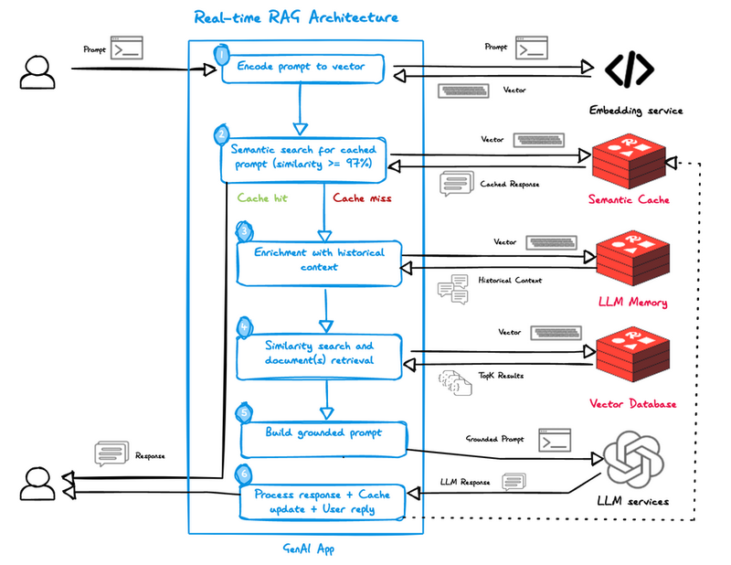

# NOTES

## Real-time RAG

[ref](https://redis.io/blog/using-redis-for-real-time-rag-goes-beyond-a-vector-database/)

redis: Remote DIctionary Server

3 steps befor the user query meets the LLM service:

1. encode query using the embedding service
2. lookup for similar responses in semantic cache
3. incase of cache miss, retrieve historical context from LLM memory
4. with the augmented prompt, get the top K documents from the vector db
5. build a grounded prompt for LLM service
6. send it to the LLM service
7. process the response, semantic cache update & finally reply to user

### Semantic cache

`db = 1`

Think: general caching adapted for LLM's.

Semantic cache helps find contextual similarity between the current query and previous queries.

If there is a high similarity, then provide the previous response.

Else move on to retrieval.

### LLM Memory

Memory across user chats and sessions

advantages:

* personalization
* context awareness
* avoid generic recommendations

## Retrieval

`db = 0`

The usual vector db with document vectors and metadata

Similarity search to retrieve relevant documents to augment the grounded prompt for LLM
